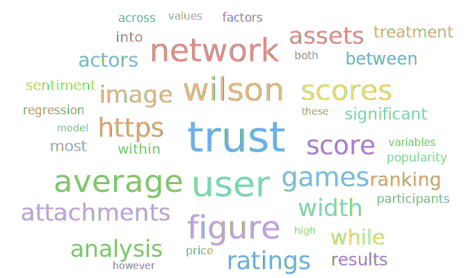

# About Me
Final year master student at École Polytechnique in Paris! 

## 🔬 Research Interests

<table>
  <tr>
    <td align="center" width="33%">🗳️ <b>Computational Social Science</b> Data-driven methods applied to political phenomena</td>
    <td align="center" width="33%">🗣️ <b>NLP & Political Language</b> Text analysis, framing, and discourse in politics</td>
    <td align="center" width="33%">🤝 <b>Human–AI Interaction</b> How humans engage with and are shaped by AI systems</td>
  </tr>
</table>

## 🔬 Research Interests

# 💻 Tech Stack
  

# 📊 GitHub Stats
 
 

### World cloud of my most used words!
<!-- WORDCLOUD_START -->

<!-- WORDCLOUD_END -->

### ✍️ Random Dev Quote

<!-- Proudly created with GPRM ( https://gprm.itsvg.in ) -->
